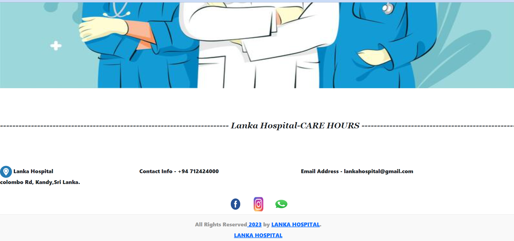
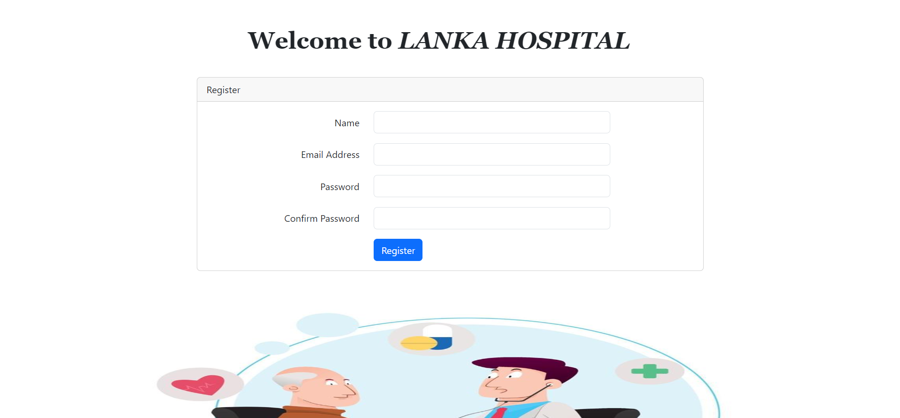
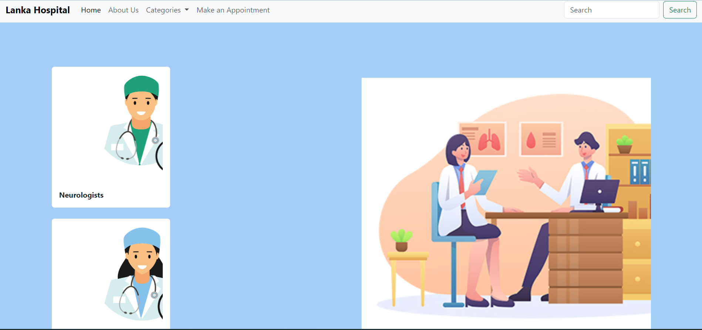
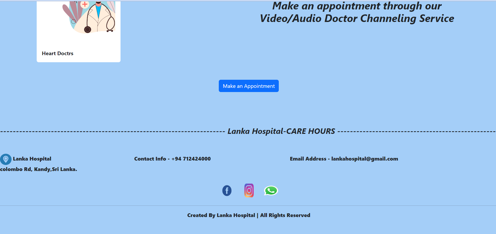
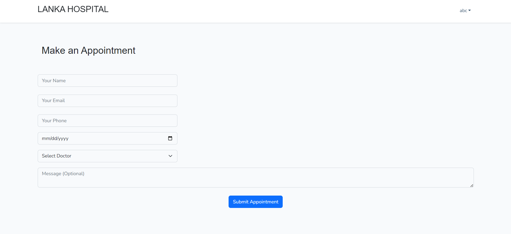
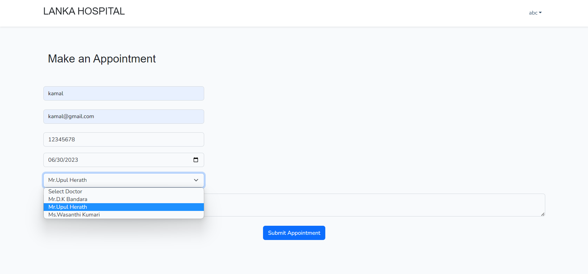
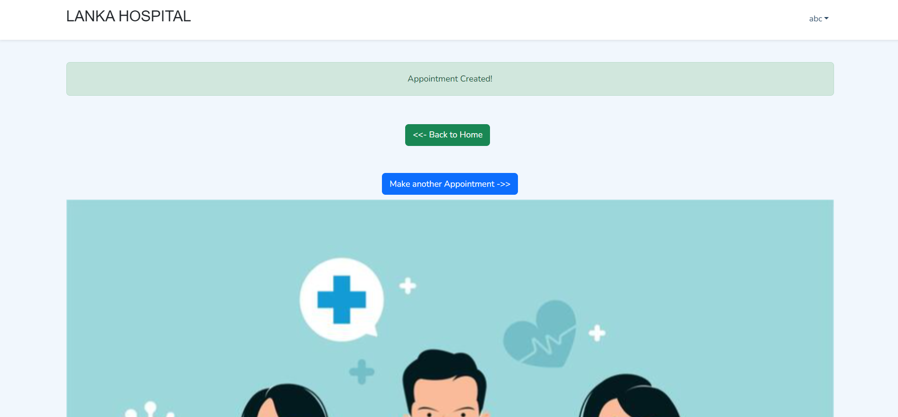
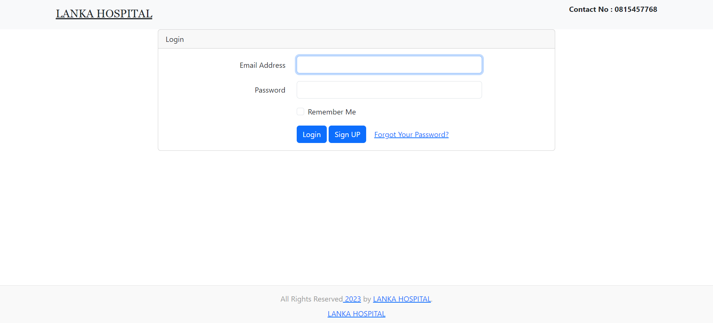
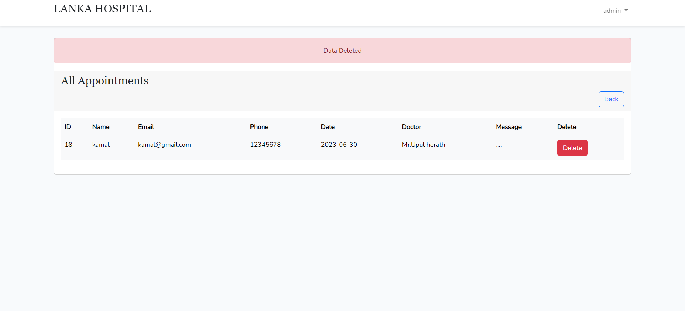

<html>
    <head>    
    </head>
    <body>
        <h1> E Channeling Application </h1>
         
        <h3>What is this repository for?</h3>
        <ul>
            <li> E Channeling Application for a Hospital. </li>
        </ul> 
        <h3>Features</h3>
        <ul>
            <li>User Sign Up</li>
            <li>User Sign In</li>
            <li>Catogory Selection</li>
            <li>Make a appoinment </li>
            <li>Admin login </li>
            <li>View patient Details and appoinment Details</li>
            <li>Add patient, Delete and Edit Details</li>
        </ul>
        
           
              
                 
                    
                       
                          
                             
                                
                                   
                                      
          
        
   
    
        <h3>contact details</h3>
        <ul>
            <li>darshanithennakoon371@gmail.com</li>
        </ul>
    </body>
</html>
